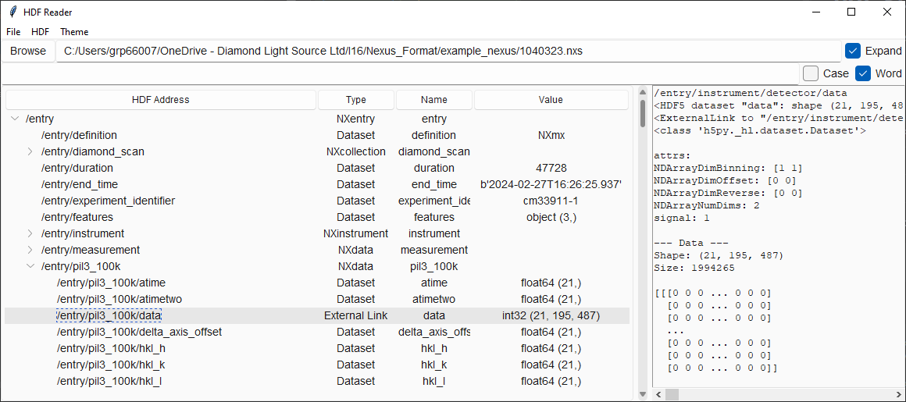

# hdf_scan_inspector
Simple, lightweight tkGUIs for inspecting the structure of HDF and Nexus files.



**Version 0.1**

| By Dan Porter        | 
|----------------------|
| Diamond Light Source |
| 2024                 |


#### To run viewer:
```commandline
$ python -m hdf_scan_inspector 'file.hdf'
```

or in python:
```python
from hdf_scan_inspector import HDFViewer
HDFViewer('file.nxs')

from hdf_scan_inspector import dataset_selector
address = dataset_selector('file.nxs', 'Select your favourite dataset')

import h5py
with h5py.File('file.nxs', 'r') as hdf:
    dataset = hdf.get(address)
    data = dataset[()]
    print(dataset)
    print(data)
```

#### Requires:
*h5py, tkinter, sv_ttk*


#### HDFViewer:
Display cascading hierarchical data within HDF file in ttk GUI
```python
HDFViewer("filename.h5")
```
Simple ttk interface for browsing HDF file structures.
 - Click Browse or File>Select File to pick a HDF, H5 or NeXus file
 - Collapse and expand the tree to view the file structure
 - Search for addresses using the search bar
 - Click on a dataset or group to view stored attributes and data

#### HDFSelector
HDF Dataset Selector - simple ttk interface to view file structure and select an address
```python
address = HDFSelector("hdf_file.h5").show()
```
        
Upon opening, the GUI will wait for until a dataset address is selected.
 - Double-click on a dataset to return the address of that dataset.
 - start typing on the keyboard to search through dataset names

